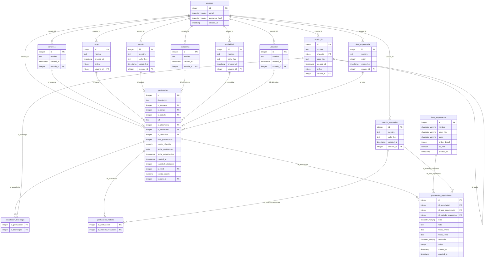

# Modelo de Base de Datos Actual

El siguiente diagrama representa el modelo de entidad-relación (ER) actual de la base de datos de la aplicación.

```mermaid
erDiagram
    usuarios {
        integer id PK
        character_varying email
        character_varying password_hash
        timestamp created_at
    }

    empresa {
        integer id PK
        text nombre
        timestamp created_at
        integer usuario_id FK
    }

    cargo {
        integer id PK
        text nombre
        timestamp created_at
        integer orden
        integer usuario_id FK
    }
    
    estado {
        integer id PK
        text nombre
        text color_hex
        timestamp created_at
        integer usuario_id FK
    }
    
    plataforma {
        integer id PK
        text nombre
        timestamp created_at
        integer usuario_id FK
    }
    
    modalidad {
        integer id PK
        text nombre
        text color_hex
        timestamp created_at
        integer usuario_id FK
    }
    
    ubicacion {
        integer id PK
        text nombre
        timestamp created_at
        integer usuario_id FK
    }
    
    nivel_experiencia {
        integer id PK
        text nombre
        integer orden
        timestamp created_at
        integer usuario_id FK
    }

    tecnologia {
        integer id PK
        text nombre
        integer id_padre FK
        text color_hex
        timestamp created_at
        integer orden
        integer usuario_id FK
    }

    metodo_evaluacion {
        integer id PK
        text nombre
        text color_hex
        timestamp created_at
        integer usuario_id FK
    }

    postulacion {
        integer id PK
        text descripcion
        integer id_empresa FK
        integer id_cargo FK
        integer id_estado FK
        text url
        integer id_plataforma FK
        integer id_modalidad FK
        integer id_ubicacion FK
        integer dias_presenciales
        numeric sueldo_ofrecido
        date fecha_postulacion
        timestamp fecha_actualizacion
        timestamp created_at
        integer cantidad_solicitudes
        integer id_nivel FK
        numeric sueldo_pedido
        integer usuario_id FK
    }

    postulacion_tecnologia {
        integer id_postulacion FK
        integer id_tecnologia FK
    }

    postulacion_metodo {
        integer id_postulacion FK
        integer id_metodo_evaluacion FK
    }

    fase_seguimiento {
        integer id PK
        character_varying nombre
        character_varying color_hex
        character_varying icono
        integer orden_default
        boolean es_final
        timestamp created_at
    }

    postulacion_seguimiento {
        integer id PK
        integer id_postulacion FK
        integer id_fase_seguimiento FK
        integer id_metodo_evaluacion FK
        character_varying titulo
        text nota
        date fecha_evento
        date fecha_limite
        character_varying resultado
        integer orden
        timestamp created_at
        timestamp updated_at
    }

    usuarios ||--o{ empresa : "usuario_id"
    usuarios ||--o{ cargo : "usuario_id"
    usuarios ||--o{ estado : "usuario_id"
    usuarios ||--o{ plataforma : "usuario_id"
    usuarios ||--o{ modalidad : "usuario_id"
    usuarios ||--o{ ubicacion : "usuario_id"
    usuarios ||--o{ nivel_experiencia : "usuario_id"
    usuarios ||--o{ tecnologia : "usuario_id"
    usuarios ||--o{ metodo_evaluacion : "usuario_id"
    usuarios ||--o{ postulacion : "usuario_id"

    tecnologia ||--o{ tecnologia : "id_padre"

    empresa ||--o{ postulacion : "id_empresa"
    cargo ||--o{ postulacion : "id_cargo"
    estado ||--o{ postulacion : "id_estado"
    plataforma ||--o{ postulacion : "id_plataforma"
    modalidad ||--o{ postulacion : "id_modalidad"
    ubicacion ||--o{ postulacion : "id_ubicacion"
    nivel_experiencia ||--o{ postulacion : "id_nivel"

    postulacion ||--o{ postulacion_tecnologia : "id_postulacion"
    tecnologia ||--o{ postulacion_tecnologia : "id_tecnologia"

    postulacion ||--o{ postulacion_metodo : "id_postulacion"
    metodo_evaluacion ||--o{ postulacion_metodo : "id_metodo_evaluacion"

    postulacion ||--o{ postulacion_seguimiento : "id_postulacion"
    fase_seguimiento ||--o{ postulacion_seguimiento : "id_fase_seguimiento"
    metodo_evaluacion ||--o{ postulacion_seguimiento : "id_metodo_evaluacion"
```
