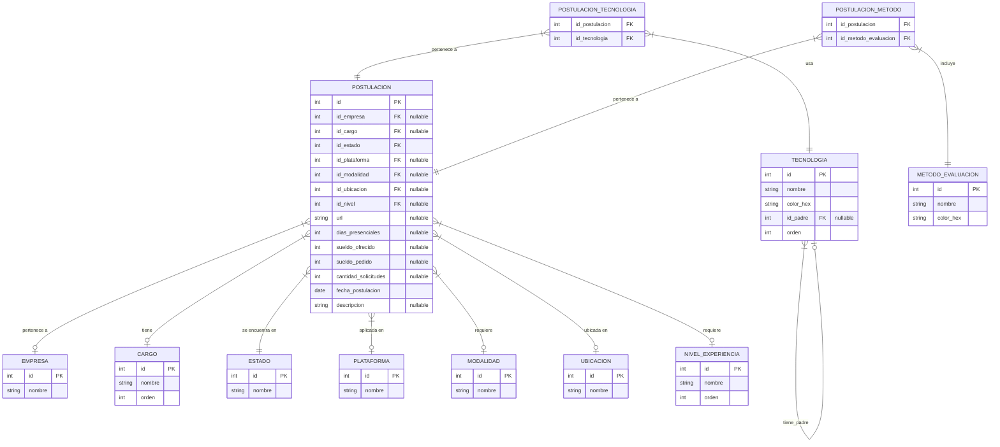
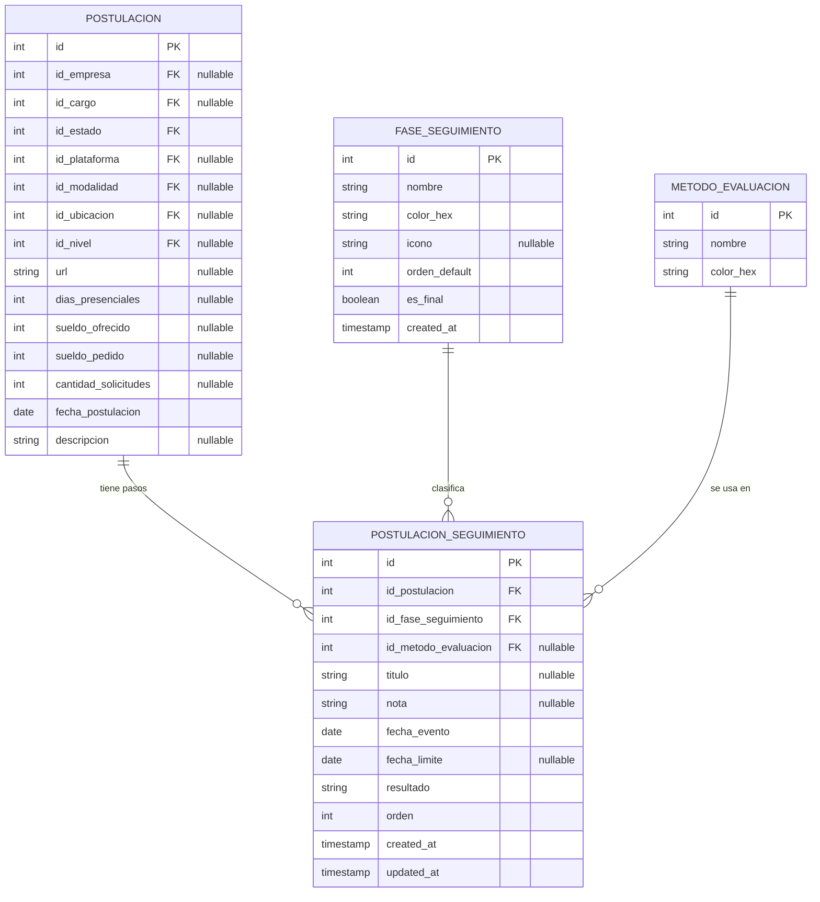

# Requerimiento: Seguimiento de Postulaciones

## 1. Objetivo

Agregar una nueva funcionalidad de **Seguimiento** para registrar el avance real de una postulación laboral después de haber sido enviada.

Actualmente la aplicación permite guardar datos generales de una postulación, tecnologías requeridas, métodos de evaluación asociados, estado, sueldo, ubicación, modalidad y otros datos base. Sin embargo, no existe un historial ordenado de eventos posteriores, como llamadas, pruebas técnicas, entrevistas, feedback, oferta, rechazo o contratación.

La nueva sección **Seguimiento** debe permitir visualizar y administrar una línea de tiempo de etapas asociadas a una postulación específica.

La idea principal es:

- Cada postulación puede tener cero o muchos pasos de seguimiento.
- Cada paso representa una **fase** del proceso.
- Cada paso puede tener opcionalmente un **método de evaluación**.
- Cada paso puede tener una nota.
- Cada paso puede tener fecha del evento.
- Cada paso puede tener fecha límite, especialmente útil para pruebas técnicas o tareas enviadas.
- El seguimiento debe mostrarse como una timeline vertical dentro del modal de editar/visualizar postulación.

## 2. Nombre de la funcionalidad

Nombre recomendado para la sección:

**Seguimiento**

Nombre recomendado para el componente visual:

**Timeline de etapas**

Alternativas consideradas:

- Línea de seguimiento
- Proceso de selección
- Etapas del proceso
- Historial de seguimiento

Se recomienda usar **Seguimiento** porque es corto, natural y fácil de entender dentro del contexto de una postulación.

## 3. Concepto clave: Fase vs Método

Actualmente existe la tabla `metodo_evaluacion`, pero algunos valores pueden estar mezclando dos conceptos distintos.

### Fase

Una **fase** representa qué parte del proceso ocurrió.

Ejemplos:

- Postulación enviada
- Contacto inicial
- Prueba técnica
- Entrevista RRHH
- Entrevista técnica
- Entrevista final
- Feedback recibido
- Oferta recibida
- Rechazo
- Contratado
- Desistido

### Método

Un **método** representa cómo se realizó la fase.

Ejemplos:

- Gmail
- Llamada telefónica
- WhatsApp
- Google Meet
- Zoom
- Teams
- Test Gorilla
- Evalart
- HackerRank
- Prueba por correo
- En vivo

### Regla recomendada

La fase debe responder:

> ¿Qué pasó?

El método debe responder:

> ¿Cómo se hizo?

Ejemplo correcto:

- Fase: `Prueba técnica`
- Método: `Test Gorilla`
- Nota: `Prueba de 60 minutos con React, lógica y SQL.`

Ejemplo incorrecto:

- Fase: `Test Gorilla`
- Método: `Prueba técnica`

## 4. Modelo actual de base de datos

Modelo actual entregado como referencia:



## 5. Modelo propuesto

Se propone agregar dos nuevas tablas:

1. `fase_seguimiento`
2. `postulacion_seguimiento`

### 5.1 Tabla `fase_seguimiento`

Esta tabla será un catálogo de fases posibles dentro del proceso de selección.

Campos recomendados:

```sql
CREATE TABLE fase_seguimiento (
    id SERIAL PRIMARY KEY,
    nombre VARCHAR(100) NOT NULL UNIQUE,
    color_hex VARCHAR(7) NOT NULL DEFAULT '#38bdf8',
    icono VARCHAR(50),
    orden_default INT NOT NULL DEFAULT 0,
    es_final BOOLEAN NOT NULL DEFAULT FALSE,
    created_at TIMESTAMP NOT NULL DEFAULT NOW()
);
```

Descripción de campos:

- `id`: identificador único.
- `nombre`: nombre de la fase.
- `color_hex`: color usado para mostrar la fase en la timeline.
- `icono`: nombre opcional de icono del frontend, por ejemplo `send`, `phone`, `file-code`, `users`, `badge-check`.
- `orden_default`: orden sugerido para mostrar fases predefinidas.
- `es_final`: indica si esta fase cierra el proceso.
- `created_at`: fecha de creación del registro.

Fases iniciales sugeridas:

```sql
INSERT INTO fase_seguimiento (nombre, color_hex, icono, orden_default, es_final) VALUES
('Postulación enviada', '#22c55e', 'send', 10, FALSE),
('Contacto inicial', '#38bdf8', 'phone', 20, FALSE),
('Prueba técnica', '#8b5cf6', 'file-code', 30, FALSE),
('Entrevista RRHH', '#06b6d4', 'users', 40, FALSE),
('Entrevista técnica', '#6366f1', 'monitor-code', 50, FALSE),
('Entrevista final', '#f59e0b', 'handshake', 60, FALSE),
('Feedback recibido', '#14b8a6', 'message-square', 70, FALSE),
('Oferta recibida', '#eab308', 'badge-dollar-sign', 80, FALSE),
('Rechazo', '#ef4444', 'x-circle', 90, TRUE),
('Contratado', '#22c55e', 'badge-check', 100, TRUE),
('Desistido', '#94a3b8', 'circle-slash', 110, TRUE);
```

### 5.2 Tabla `postulacion_seguimiento`

Esta tabla registra los pasos reales que ocurrieron para una postulación específica.

Campos recomendados:

```sql
CREATE TABLE postulacion_seguimiento (
    id SERIAL PRIMARY KEY,
    id_postulacion INT NOT NULL REFERENCES postulacion(id) ON DELETE CASCADE,
    id_fase_seguimiento INT NOT NULL REFERENCES fase_seguimiento(id),
    id_metodo_evaluacion INT REFERENCES metodo_evaluacion(id),
    titulo VARCHAR(150),
    nota TEXT,
    fecha_evento DATE NOT NULL,
    fecha_limite DATE,
    resultado VARCHAR(30) NOT NULL DEFAULT 'pendiente',
    orden INT NOT NULL DEFAULT 0,
    created_at TIMESTAMP NOT NULL DEFAULT NOW(),
    updated_at TIMESTAMP NOT NULL DEFAULT NOW()
);
```

Descripción de campos:

- `id`: identificador único del paso.
- `id_postulacion`: postulación a la que pertenece el paso.
- `id_fase_seguimiento`: fase del proceso.
- `id_metodo_evaluacion`: método usado, opcional.
- `titulo`: texto opcional para personalizar el título del paso.
- `nota`: nota libre del usuario.
- `fecha_evento`: fecha en que ocurrió el evento o se recibió la solicitud.
- `fecha_limite`: fecha límite opcional, especialmente para pruebas técnicas.
- `resultado`: estado puntual del paso.
- `orden`: orden manual dentro de la timeline.
- `created_at`: fecha de creación.
- `updated_at`: fecha de última actualización.

Valores sugeridos para `resultado`:

- `pendiente`
- `completado`
- `aprobado`
- `rechazado`
- `cancelado`

Restricción sugerida:

```sql
ALTER TABLE postulacion_seguimiento
ADD CONSTRAINT chk_postulacion_seguimiento_resultado
CHECK (resultado IN ('pendiente', 'completado', 'aprobado', 'rechazado', 'cancelado'));
```

Índices sugeridos:

```sql
CREATE INDEX idx_postulacion_seguimiento_postulacion
ON postulacion_seguimiento(id_postulacion);

CREATE INDEX idx_postulacion_seguimiento_fecha
ON postulacion_seguimiento(fecha_evento);

CREATE INDEX idx_postulacion_seguimiento_fase
ON postulacion_seguimiento(id_fase_seguimiento);
```

## 6. Modelo ER actualizado



## 7. Cambios requeridos en backend

Repositorio:

`postulaciones_backend`

Stack actual:

- Express
- TypeScript
- PostgreSQL
- `pg`

### 7.1 Migración o script SQL

Crear un script SQL para:

1. Crear tabla `fase_seguimiento`.
2. Crear tabla `postulacion_seguimiento`.
3. Insertar fases iniciales.
4. Crear índices.
5. Crear restricción de `resultado`.

Archivo sugerido:

```text
sql/seguimiento.sql
```

O si el proyecto maneja scripts sueltos:

```text
database/seguimiento.sql
```

### 7.2 Rutas nuevas para fases

Actualmente `catalogs.ts` permite tablas genéricas mediante `ALLOWED_TABLES`.

Se debe agregar:

```ts
'fase_seguimiento'
```

al arreglo `ALLOWED_TABLES`.

Esto permitiría:

```text
GET    /api/fase_seguimiento
POST   /api/fase_seguimiento
PUT    /api/fase_seguimiento/:id
DELETE /api/fase_seguimiento/:id
```

Consideración:

Para `fase_seguimiento`, el orden recomendado debe ser:

```sql
ORDER BY orden_default ASC, nombre ASC
```

Actualmente `catalogs.ts` tiene orden especial para `cargo`, `nivel_experiencia` y `tecnologia`. Se debe sumar un caso especial para `fase_seguimiento`.

### 7.3 Rutas nuevas para seguimiento

Crear un archivo nuevo:

```text
src/routes/seguimiento.ts
```

Endpoints recomendados:

```text
GET    /api/postulaciones/:id/seguimiento
POST   /api/postulaciones/:id/seguimiento
PUT    /api/postulaciones/:id/seguimiento/:stepId
DELETE /api/postulaciones/:id/seguimiento/:stepId
```

También se puede crear bajo:

```text
src/routes/postulaciones.ts
```

pero se recomienda archivo separado para mantener el router de postulaciones más limpio.

### 7.4 GET seguimiento de una postulación

Endpoint:

```text
GET /api/postulaciones/:id/seguimiento
```

Debe devolver los pasos de seguimiento de una postulación ordenados por:

1. `orden ASC`
2. `fecha_evento ASC`
3. `id ASC`

Respuesta esperada:

```json
[
  {
    "id": 1,
    "id_postulacion": 15,
    "id_fase_seguimiento": 1,
    "id_metodo_evaluacion": null,
    "titulo": null,
    "nota": "Postulación enviada desde BNE.",
    "fecha_evento": "2026-06-07",
    "fecha_limite": null,
    "resultado": "completado",
    "orden": 10,
    "fase": {
      "id": 1,
      "nombre": "Postulación enviada",
      "color_hex": "#22c55e",
      "icono": "send",
      "orden_default": 10,
      "es_final": false
    },
    "metodo": null
  }
]
```

Consulta base sugerida:

```sql
SELECT ps.*,
       row_to_json(fs) AS fase,
       row_to_json(me) AS metodo
FROM postulacion_seguimiento ps
JOIN fase_seguimiento fs ON ps.id_fase_seguimiento = fs.id
LEFT JOIN metodo_evaluacion me ON ps.id_metodo_evaluacion = me.id
WHERE ps.id_postulacion = $1
ORDER BY ps.orden ASC, ps.fecha_evento ASC, ps.id ASC;
```

### 7.5 POST crear paso de seguimiento

Endpoint:

```text
POST /api/postulaciones/:id/seguimiento
```

Body esperado:

```json
{
  "id_fase_seguimiento": 3,
  "id_metodo_evaluacion": 5,
  "titulo": "Prueba frontend",
  "nota": "Prueba React + lógica + SQL.",
  "fecha_evento": "2026-06-12",
  "fecha_limite": "2026-06-14",
  "resultado": "pendiente",
  "orden": 30
}
```

Validaciones mínimas:

- `id_postulacion` debe venir desde `req.params.id`.
- `id_fase_seguimiento` es obligatorio.
- `fecha_evento` es obligatoria.
- `resultado` debe pertenecer al conjunto permitido.
- `id_metodo_evaluacion` puede ser `null`.
- `titulo`, `nota` y `fecha_limite` pueden ser `null`.

### 7.6 PUT actualizar paso de seguimiento

Endpoint:

```text
PUT /api/postulaciones/:id/seguimiento/:stepId
```

Debe permitir actualizar:

- `id_fase_seguimiento`
- `id_metodo_evaluacion`
- `titulo`
- `nota`
- `fecha_evento`
- `fecha_limite`
- `resultado`
- `orden`

Importante:

El `UPDATE` debe validar que el paso pertenece a la postulación indicada:

```sql
WHERE id = $stepId AND id_postulacion = $postulacionId
```

### 7.7 DELETE eliminar paso de seguimiento

Endpoint:

```text
DELETE /api/postulaciones/:id/seguimiento/:stepId
```

Debe eliminar solamente si el paso pertenece a la postulación indicada:

```sql
DELETE FROM postulacion_seguimiento
WHERE id = $1 AND id_postulacion = $2
```

### 7.8 Integración con `src/index.ts`

Importar y montar el router:

```ts
import seguimientoRouter from './routes/seguimiento.js';
```

Ruta sugerida:

```ts
app.use('/api/postulaciones', seguimientoRouter);
```

El router interno debería definir rutas como:

```ts
router.get('/:id/seguimiento', ...)
router.post('/:id/seguimiento', ...)
router.put('/:id/seguimiento/:stepId', ...)
router.delete('/:id/seguimiento/:stepId', ...)
```

Importante:

Este router debe montarse antes de rutas genéricas que puedan capturar `/:id`.

En el backend actual, `postulacionesRouter` ya maneja:

```text
GET    /api/postulaciones
POST   /api/postulaciones
PUT    /api/postulaciones/:id
DELETE /api/postulaciones/:id
```

Como no existe `GET /api/postulaciones/:id`, el riesgo es bajo, pero se recomienda mantener rutas específicas antes de rutas genéricas.

### 7.9 Posible sincronización con estado de postulación

Opcionalmente, cuando se agregue una fase final como:

- `Rechazo`
- `Contratado`
- `Desistido`

se podría actualizar automáticamente `postulacion.id_estado`.

Sin embargo, para el primer MVP se recomienda **no automatizar todavía** esta sincronización, para evitar reglas ambiguas.

La postulación puede tener:

- Estado general: `En Espera`, `En Proceso`, `Rechazada`, etc.
- Seguimiento detallado: timeline de eventos.

En una segunda iteración se puede crear una regla de negocio explícita.

## 8. Cambios requeridos en frontend

Repositorio:

`postulaciones_analisis_final`

Stack actual:

- Vite
- React
- TypeScript
- Tailwind
- lucide-react

### 8.1 Tipos nuevos en `src/lib/api.ts`

Agregar tipos:

```ts
export type FaseSeguimiento = {
  id: number;
  nombre: string;
  color_hex: string;
  icono: string | null;
  orden_default: number;
  es_final: boolean;
  created_at?: string;
};

export type ResultadoSeguimiento =
  | 'pendiente'
  | 'completado'
  | 'aprobado'
  | 'rechazado'
  | 'cancelado';

export type PostulacionSeguimiento = {
  id: number;
  id_postulacion: number;
  id_fase_seguimiento: number;
  id_metodo_evaluacion: number | null;
  titulo: string | null;
  nota: string | null;
  fecha_evento: string;
  fecha_limite: string | null;
  resultado: ResultadoSeguimiento;
  orden: number;
  created_at?: string;
  updated_at?: string;
  fase: FaseSeguimiento;
  metodo: MetodoEvaluacion | null;
};
```

### 8.2 Hook para fases

En `src/hooks/useData.ts`, agregar hook:

```ts
export const useFasesSeguimiento = () => useCatalog<FaseSeguimiento>('fase_seguimiento');
```

El nombre puede variar según el patrón actual del archivo, pero debe seguir la misma estructura de los hooks existentes:

- `useEmpresas`
- `useCargos`
- `useEstados`
- `useMetodos`
- `useNiveles`

### 8.3 Hook para seguimiento

Crear archivo sugerido:

```text
src/hooks/useSeguimiento.ts
```

Responsabilidades:

- Cargar pasos de una postulación.
- Crear paso.
- Actualizar paso.
- Eliminar paso.
- Exponer `loading`, `error`, `rows` y `reload`.

Firma conceptual:

```ts
export function useSeguimiento(postulacionId?: number) {
  return {
    rows,
    loading,
    error,
    reload,
    createStep,
    updateStep,
    deleteStep,
  };
}
```

### 8.4 Nuevo componente `SeguimientoTimeline`

Crear componente:

```text
src/components/postulaciones/SeguimientoTimeline.tsx
```

Responsabilidades:

- Mostrar timeline vertical.
- Renderizar cada paso con:
  - Icono de fase.
  - Nombre de fase o título personalizado.
  - Fecha del evento.
  - Método, si existe.
  - Fecha límite, si existe.
  - Nota, si existe.
  - Resultado.
- Permitir agregar paso.
- Permitir editar paso.
- Permitir eliminar paso.
- Respetar `readOnly`.

Props sugeridas:

```ts
type Props = {
  postulacionId: number;
  fases: FaseSeguimiento[];
  metodos: MetodoEvaluacion[];
  readOnly?: boolean;
};
```

### 8.5 Formulario de paso de seguimiento

Puede implementarse dentro de `SeguimientoTimeline` o como componente separado.

Componente separado sugerido:

```text
src/components/postulaciones/SeguimientoStepForm.tsx
```

Campos:

- Fase
- Método de evaluación
- Título opcional
- Fecha evento
- Fecha límite opcional
- Resultado
- Nota

UI sugerida:

- Formulario compacto dentro de un modal pequeño o panel inline.
- Botón `+ Paso` en la cabecera de la sección.
- Para editar, botón con icono `Pencil`.
- Para eliminar, botón con icono `Trash2`.

### 8.6 Modal de editar/visualizar más ancho

Actualmente el modal de agregar/editar usa `size="xl"`.

Requerimiento:

- El modal de **Agregar Postulación** debe mantenerse como está actualmente.
- El modal de **Editar Postulación** debe hacerse más ancho.
- El modal de **Detalle de Postulación** debe hacerse más ancho.
- Solo editar/visualizar deben mostrar la cuarta sección `Seguimiento`.

Regla propuesta:

```tsx
const modalSize = editing ? 'wide' : 'xl';
```

Donde:

- `editing === null`: nueva postulación, layout actual de 3 columnas.
- `editing !== null`: editar o visualizar, layout nuevo de 4 columnas.

Se debe revisar el componente:

```text
src/components/ui/Modal.tsx
```

Y agregar un tamaño nuevo, por ejemplo:

```ts
size: 'sm' | 'md' | 'lg' | 'xl' | 'wide'
```

Clase sugerida para `wide`:

```text
max-w-[1500px] w-[92vw]
```

O:

```text
max-w-[1440px] w-[94vw]
```

### 8.7 Cambios en `PostulacionesPage.tsx`

Actualmente el modal usa:

```tsx
<Modal
  open={formOpen}
  onClose={() => setFormOpen(false)}
  title={editing ? (formReadOnly ? 'Detalle de Postulación' : 'Editar Postulación') : 'Nueva Postulación'}
  size="xl"
>
```

Cambio sugerido:

```tsx
<Modal
  open={formOpen}
  onClose={() => setFormOpen(false)}
  title={editing ? (formReadOnly ? 'Detalle de Postulación' : 'Editar Postulación') : 'Nueva Postulación'}
  size={editing ? 'wide' : 'xl'}
>
```

Además, pasar nuevas props al formulario:

```tsx
fasesSeguimiento={fasesSeguimiento}
```

si se cargan desde `PostulacionesPage`.

### 8.8 Cambios en `PostulacionForm.tsx`

Actualmente el formulario está dividido en 3 columnas:

1. Detalles Generales
2. Conocimientos
3. Contratación & Seguimiento

Nuevo comportamiento:

#### Cuando es Nueva Postulación

Mantener exactamente el comportamiento actual:

1. Detalles Generales
2. Conocimientos
3. Contratación & Seguimiento

No mostrar timeline.

#### Cuando es Editar o Visualizar

Usar layout de 4 columnas:

1. Detalles Generales
2. Conocimientos
3. Contratación
4. Seguimiento

La columna 3 debería cambiar su título desde:

```text
3. Contratación & Seguimiento
```

a:

```text
3. Contratación
```

La columna 4 debería tener:

```text
4. Seguimiento
```

La columna 4 renderiza:

```tsx
<SeguimientoTimeline
  postulacionId={item.id}
  fases={fasesSeguimiento}
  metodos={metodos}
  readOnly={readOnly}
/>
```

Condición:

```tsx
const showSeguimiento = Boolean(item);
```

Clase de grid sugerida:

```tsx
<div className={showSeguimiento ? 'grid grid-cols-4 gap-6' : 'grid grid-cols-3 gap-6'}>
```

En pantallas más pequeñas, se podría usar:

```tsx
className={showSeguimiento ? 'grid grid-cols-1 xl:grid-cols-4 gap-6' : 'grid grid-cols-1 lg:grid-cols-3 gap-6'}
```

### 8.9 Comportamiento en modo solo lectura

Cuando `readOnly = true`:

- Mostrar timeline.
- No mostrar botón `+ Paso`.
- No mostrar botones editar/eliminar.
- Mostrar únicamente la información.

Cuando `readOnly = false`:

- Mostrar timeline.
- Mostrar botón `+ Paso`.
- Permitir editar pasos.
- Permitir eliminar pasos.

### 8.10 Estado vacío

Si una postulación no tiene pasos de seguimiento:

Texto sugerido:

```text
Sin seguimiento registrado
```

En edición:

```text
Agrega el primer paso para registrar llamadas, pruebas o entrevistas.
```

En visualización:

```text
Todavía no hay eventos registrados para esta postulación.
```

### 8.11 Iconos sugeridos

Usar `lucide-react`, ya instalado.

Mapeo sugerido:

```ts
const iconMap = {
  send: Send,
  phone: Phone,
  'file-code': FileCode,
  users: Users,
  'monitor-code': Monitor,
  handshake: Handshake,
  'message-square': MessageSquare,
  'badge-dollar-sign': BadgeDollarSign,
  'x-circle': XCircle,
  'badge-check': BadgeCheck,
  'circle-slash': CircleSlash,
};
```

Si un icono no existe o no está definido:

```ts
Circle
```

## 9. Relación con `postulacion_metodo`

Actualmente existe:

```text
postulacion_metodo
```

Esta tabla asocia métodos a una postulación en general.

Con la nueva funcionalidad, el método se puede asociar directamente a cada paso de seguimiento mediante:

```text
postulacion_seguimiento.id_metodo_evaluacion
```

### Recomendación para MVP

No eliminar `postulacion_metodo`.

Mantenerlo porque ya está integrado en:

- listado de postulaciones
- formulario actual
- dashboard
- estadísticas actuales

Pero para el seguimiento nuevo, usar `id_metodo_evaluacion` dentro de cada paso.

### Posible mejora futura

En una segunda etapa, se podría decidir si:

1. `postulacion_metodo` se mantiene como resumen global.
2. `postulacion_metodo` se genera automáticamente desde los pasos de seguimiento.
3. `postulacion_metodo` se elimina y los métodos se obtienen desde la timeline.

Para evitar romper la aplicación actual, se recomienda mantener ambos por ahora.

## 10. Reglas de negocio recomendadas

### 10.1 Crear postulación

Al crear una nueva postulación:

- No es obligatorio crear pasos de seguimiento.
- El modal de agregar se mantiene igual.

Opcional futuro:

Crear automáticamente un paso:

- Fase: `Postulación enviada`
- Fecha evento: `fecha_postulacion`
- Resultado: `completado`

Para el MVP inicial se recomienda no hacerlo automáticamente, salvo que el usuario lo quiera.

### 10.2 Editar postulación

Al editar una postulación existente:

- Se muestra la columna 4 `Seguimiento`.
- Se pueden agregar, editar y eliminar pasos.

### 10.3 Visualizar postulación

Al visualizar una postulación:

- Se muestra la columna 4 `Seguimiento`.
- La timeline aparece en modo solo lectura.

### 10.4 Orden de pasos

El orden recomendado:

1. `orden`
2. `fecha_evento`
3. `id`

Cuando se crea un paso nuevo, si no se define orden manual:

- Usar `fase_seguimiento.orden_default`.
- Si hay varias fases iguales, se puede sumar un incremento pequeño o dejar que fecha/id resuelva el orden.

### 10.5 Fechas

Cada paso debe tener:

- `fecha_evento`: obligatoria.

Cada paso puede tener:

- `fecha_limite`: opcional.

Ejemplos:

- Contacto inicial:
  - `fecha_evento`: fecha en que llegó el correo o llamada.
  - `fecha_limite`: null.
- Prueba técnica:
  - `fecha_evento`: fecha en que se recibió la prueba.
  - `fecha_limite`: fecha máxima para entregarla.

## 11. Diseño visual esperado

La sección `Seguimiento` debe verse como una timeline vertical compacta.

Estructura visual:

```text
4. SEGUIMIENTO

[+ Paso]

● Postulación enviada        07-06-2026
│  Nota opcional
│
● Contacto inicial           10-06-2026
│  Método: Gmail
│  Nota: Pidieron disponibilidad.
│
● Prueba técnica             12-06-2026
│  Método: Test Gorilla
│  Límite: 14-06-2026
│  Nota: React + lógica + SQL.
│
○ Entrevista técnica         Pendiente
```

Visualmente:

- Línea vertical al lado izquierdo.
- Puntos circulares por fase.
- Color del punto según `fase.color_hex`.
- Card pequeña por cada paso.
- Badge para método.
- Badge para fecha límite.
- Nota en texto secundario.
- Estado pendiente/completado visible.

## 12. Preview generado

Se generó un preview del modal con cuatro columnas:

```text
outputs/preview-modal-4-seguimiento.svg
```

Idea principal del preview:

- Modal de editar/visualizar más ancho.
- Columnas:
  1. Detalles Generales
  2. Conocimientos
  3. Contratación
  4. Seguimiento
- El modal de agregar postulación se mantiene igual al actual.

## 13. Implementación sugerida por etapas

### Etapa 1: Base de datos

- Crear `fase_seguimiento`.
- Crear `postulacion_seguimiento`.
- Insertar fases iniciales.
- Agregar índices.
- Agregar constraint de resultado.

### Etapa 2: Backend

- Agregar `fase_seguimiento` a catálogos.
- Crear endpoints CRUD para seguimiento.
- Verificar `GET /api/postulaciones/:id/seguimiento`.
- Verificar creación, edición y eliminación de pasos.

### Etapa 3: Frontend tipos y hooks

- Agregar tipos en `api.ts`.
- Agregar hook `useFasesSeguimiento`.
- Crear hook `useSeguimiento`.

### Etapa 4: Frontend UI

- Agregar tamaño `wide` al modal.
- Cambiar `PostulacionesPage` para usar `wide` solo en editar/visualizar.
- Modificar `PostulacionForm` para usar 3 o 4 columnas según si existe `item`.
- Crear `SeguimientoTimeline`.
- Crear formulario de paso.

### Etapa 5: QA

- Crear postulación nueva y comprobar que el modal se mantiene igual.
- Editar postulación existente y comprobar que aparece la cuarta sección.
- Visualizar postulación y comprobar modo solo lectura.
- Agregar paso.
- Editar paso.
- Eliminar paso.
- Validar que la timeline respeta fechas, orden y modo readOnly.

## 14. Riesgos y consideraciones

### 14.1 Mezcla conceptual entre fase y método

Riesgo:

Seguir usando métodos como si fueran fases.

Mitigación:

Crear catálogo `fase_seguimiento` separado y usar `metodo_evaluacion` solo para el cómo.

### 14.2 Modal demasiado ancho en pantallas pequeñas

Riesgo:

El modal de cuatro columnas puede quedar apretado.

Mitigación:

Usar `w-[94vw]`, `max-w-[1440px]` o `max-w-[1500px]`, y permitir scroll horizontal o responsive grid si es necesario.

### 14.3 Duplicidad entre `postulacion_metodo` y métodos por paso

Riesgo:

Los métodos globales de una postulación y los métodos del seguimiento pueden diferir.

Mitigación:

Mantener ambos en MVP. Más adelante decidir si se sincronizan.

### 14.4 Automatizar estado demasiado pronto

Riesgo:

Que agregar una fase final cambie el estado general de una postulación sin intención del usuario.

Mitigación:

No sincronizar automáticamente en el MVP. Mantenerlo manual.

## 15. Resultado esperado

Al finalizar, la aplicación permitirá:

- Mantener el formulario de nueva postulación igual que ahora.
- Editar o visualizar postulaciones con un modal más ancho.
- Ver una cuarta sección llamada `Seguimiento`.
- Registrar pasos reales del proceso de selección.
- Distinguir claramente fase y método.
- Guardar notas y fechas por cada paso.
- Tener una timeline visual clara, compacta y útil para seguimiento laboral.

